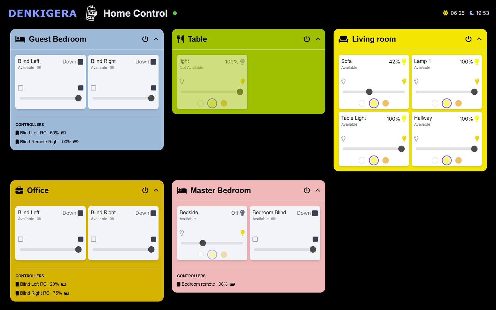

# DENKIGERA

A self-hosted web UI and proxy server for the **IKEA DIRIGERA** smart home hub.

Denkigera provides a simple, clean web interface to control your IKEA smart devices. It also acts as a lightweight proxy server, offering a straightforward API endpoint for your devices, which simplifies integrations with other systems in your smart home setup.



---

## Features

* **Clean Web UI**: An intuitive interface to view and control all your DIRIGERA-connected devices from any browser.
* **Simple Proxy Server**: A clean API proxy to interact with your devices programmatically.
* **Self-Hosted**: Runs on your own hardware (like a Raspberry Pi) for maximum privacy and control.
* **Easy Setup**: A simple installation script to get you up and running quickly.

---

## Installation

These instructions are for a Debian-based Linux system (e.g., Raspberry Pi OS, Ubuntu) with `systemd`, `nginx`, and `nvm` (Node Version Manager) already installed.

### Step 1: Clone the Repository

First, clone this repository to your machine and navigate into the directory.

```bash
git clone https://github.com/0xtosh/denkigera.git
cd denkigera
bash install.sh
```

### Step 2: Generate a token

Run the authentication command. After running it, you will be prompted to press the action button on the bottom of your DIRIGERA hub. This physical action approves the pairing request.

```sudo su -s /bin/bash -c "source ~/.nvm/nvm.sh && npx dirigera authenticate" "nodeapp"```

Paste the token into the following command, replacing PASTE_YOUR_TOKEN_HERE. This writes your token to the application's token file:

```echo "PASTE_YOUR_TOKEN_HERE" | sudo tee /var/www/app/token.txt```

### Step 3: Restart the Application

For the new token to be loaded, you must restart the Denkigera service.

```
sudo systemctl restart denkigera
sudo systemctl status denkigera
sudo journalctl -u denkigera -f
```

Manage the Nginx web server:

Check status, restart, or stop Nginx
```
sudo systemctl status nginx
sudo systemctl restart nginx
sudo systemctl stop nginx
```
